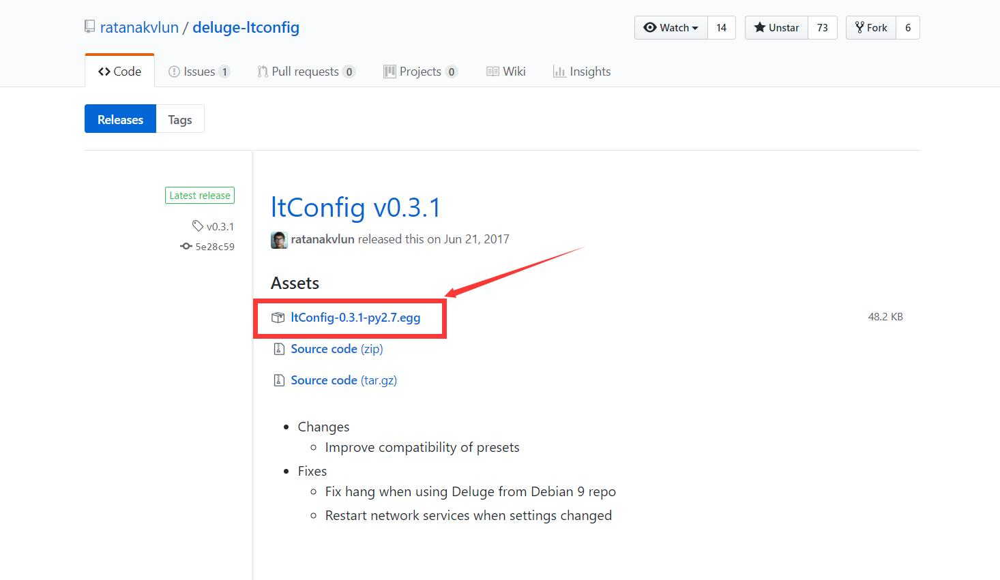
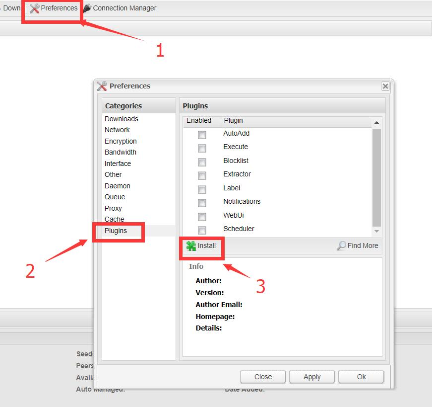

# Ubuntu/Debian Linux编译Deluge安装

## 前言

透過APT安裝的Deluge有兩個缺點：版本老舊 \(特別是Debian\)、不能指定版本。

此教學通過測試於Ubuntu 16.04/18.04 和 Debian 8/9。

以下將從Deluge官網下載安裝包，並使用Deluged和Deluge-web \(WebUI\)  
文章下半段有Deluge2.0安裝教學

上次更新日期：2019 年 11 月 9 日

## 安裝編譯libtorrent的工具和依賴

```text
apt update
apt install build-essential libboost-system-dev libboost-python-dev libboost-chrono-dev libboost-random-dev libssl-dev automake libtool 
```

編譯安裝Deluge的後端軟件libtorrent-rasterbar：

```text
wget https://github.com/arvidn/libtorrent/releases/download/libtorrent_1_1_12/libtorrent-rasterbar-1.1.12.tar.gz
tar xf libtorrent-rasterbar-1.1.12.tar.gz
cd libtorrent-rasterbar-1.1.12
./configure --disable-debug --enable-python-binding --with-libiconv
make -j$(nproc)
make install
ldconfig
```

## 安裝Deluge的工具和依賴

```text
apt install python python-twisted python-openssl python-setuptools intltool python-xdg python-chardet geoip-database python-notify python-pygame python-glade2 librsvg2-common xdg-utils python-mako
```

[http://download.deluge-torrent.org/source/](http://download.deluge-torrent.org/source/)  
從官網下載Deluge安裝包，若需指定版本請自行修改版本號 \(不適用於de2.0\)：


```text
wget http://download.deluge-torrent.org/source/deluge-1.3.15.tar.xz
```

解壓Deluge安裝包：

```text
tar xvJf deluge-1.3.15.tar.xz
cd deluge-1.3.15
```

安裝Deluge：

```text
python setup.py build
python setup.py install --install-layout=deb
```

### 設置開機自啟

```text
nano /etc/systemd/system/deluged.service
```

輸入以下內容：

```text
[Unit]
Description=Deluge Bittorrent Client Daemon
After=network.target
 
[Service]
LimitNOFILE=512000
User=root
ExecStart=/usr/bin/deluged -d
 
[Install]
WantedBy=multi-user.target
```

```text
nano /etc/systemd/system/deluge-web.service
```

輸入以下內容：

```text
[Unit]
Description=Deluge Bittorrent Client Daemon
After=network.target
 
[Service]
LimitNOFILE=512000
User=root
ExecStart=/usr/bin/deluge-web
 
[Install]
WantedBy=multi-user.target
```

啟用以上設置：

```text
systemctl enable deluged.service
systemctl enable deluge-web.service
```

啟動Deluged和WebUI：

```text
systemctl start deluged.service
systemctl start deluge-web.service
```

安裝完成！在瀏覽器輸入 http://你的IP地址:8112 即可進入DelugeWebUI

WebUI默認密碼：deluge

### 創建下載文件夾和設置權限

```text
mkdir /home/Downloads
chmod 777 /home/Downloads
```

Deluge把下載路徑設置到 /home/Downloads就OK了！

## \[嘗鮮\] 安裝Deluge2.0正式版

此部分目前僅適用於Ubuntu18。  
Deluge2.0已遷移到Python3，需要的軟件包python-libtorrent會換做python3-libtorrent。

```text
apt update
apt install build-essential checkinstall libboost-system-dev libboost-python-dev libboost-chrono-dev libboost-random-dev libssl-dev automake libtool 
```

編譯安裝Deluge的後端軟件libtorrent-rasterbar：

```text
wget https://github.com/arvidn/libtorrent/releases/download/libtorrent_1_1_12/libtorrent-rasterbar-1.1.12.tar.gz
tar xf libtorrent-rasterbar-1.1.12.tar.gz
cd libtorrent-rasterbar-1.1.12
./configure --build=x86_64-linux-gnu --prefix=/usr --includedir=\${prefix}/include --mandir=\${prefix}/share/man --infodir=\${prefix}/share/info --sysconfdir=/etc --localstatedir=/var --disable-silent-rules --libdir=\${prefix}/lib/x86_64-linux-gnu --libexecdir=\${prefix}/lib/x86_64-linux-gnu --disable-maintainer-mode --disable-dependency-tracking PYTHON=/usr/bin/python3.6 --enable-python-binding --with-boost-python=boost_python-py36 --with-libiconv --with-boost-libdir=/usr/lib/x86_64-linux-gnu
make -j$(nproc)
make install
python3 setup.py install
ldconfig
```

### 安裝Deluge的工具和依賴

```text
apt install python python3-setuptools python-twisted python-openssl python-setuptools intltool python-xdg python-chardet geoip-database python-notify python-pygame python-glade2 librsvg2-common xdg-utils python-mako
```

 [http://download.deluge-torrent.org/source/](http://download.deluge-torrent.org/source/)  
從Github獲取源碼，現時最新版本是Deluge-2.0.3，若需指定版本請自行修改版本號：

```text
git clone --branch deluge-2.0.3 https://github.com/deluge-torrent/deluge/
```

安裝Deluge：

```text
cd deluge
python3 setup.py build
python3 setup.py install --install-layout=deb
```

### 設置開機自啟

```text
nano /etc/systemd/system/deluged.service
```

輸入以下內容：

```text
[Unit]
Description=Deluge Bittorrent Client Daemon
Documentation=man:deluged
After=network-online.target

[Service]
Type=simple
UMask=007

ExecStart=/usr/bin/deluged -d

Restart=on-failure

# Time to wait before forcefully stopped.
TimeoutStopSec=300

[Install]
WantedBy=multi-user.target
```

```text
nano /etc/systemd/system/deluge-web.service
```

輸入以下內容：

```text
[Unit]
Description=Deluge Bittorrent Client Web Interface
Documentation=man:deluge-web
After=network-online.target deluged.service
Wants=deluged.service

[Service]
Type=simple
UMask=027

ExecStart=/usr/bin/deluge-web -d

Restart=on-failure

[Install]
WantedBy=multi-user.target
```

啟用以上設置：

```text
systemctl enable deluged.service
systemctl enable deluge-web.service
```

啟動Deluged和WebUI：

```text
systemctl start deluged.service
systemctl start deluge-web.service
```

安裝完成！在瀏覽器輸入 http://你的IP地址:8112 即可進入DelugeWebUI

WebUI默認密碼：deluge

### 創建下載文件夾和設置權限

```text
mkdir /home/Downloads
chmod 777 /home/Downloads
```

Deluge把下載路徑設置到 /home/Downloads就OK了！

## 安装ItConfig

> ltConfig is a plugin for Deluge that allows direct modification to libtorrent settings.
>
> 介绍页面：[http://forum.deluge-torrent.org/viewtopic.php?t=42887](https://forum.deluge-torrent.org/viewtopic.php?t=42887)

到 [https://github.com/ratanakvlun/deluge-ltconfig/releases](https://github.com/ratanakvlun/deluge-ltconfig/releases) 上下载最新的egg发布文件



进入Deluge WebUI配置页面安装



  
安装完成后启用该插件即可~

