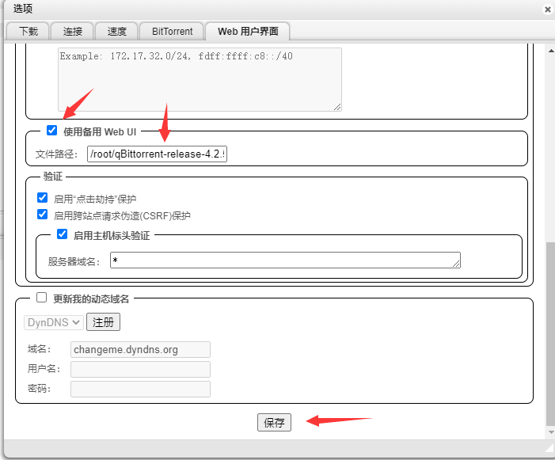

# Ubuntu/Debian Linux编译qBittorrent安装

## 前言

以下为安装最新或指定版本qBittorrent教学。

 适用于Ubuntu18或更新版本，Debian10或更新版本 

适用于qBittorrent3.3.11-4.2.5或更新版本

## 安装须知

[libtorrent](https://github.com/arvidn/libtorrent)是qBittorrent必要的后端程序，对软件性能有直接影响。

* libtorrent 1.0.11: 非常稳定，适合长时间使用，是普遍Seedbox商家/脚本使用的版本。 
* libtorrent 1.1.13: 性能更好，支援异步磁盘I/O，对高速种子比较友好，修复了1.1系列的各种问题。
* libtorrent 1.2.3 : 问题多，暂时不建议使用 
* libtorrent 1.0.11: 适用于qBittorrent3.3.11-4.1.3 
* libtorrent 1.1.13: 适用于qBittorrent4.0.0或更新版本 
* libtorrent 1.2.3 : 适用于qBittorrent4.2.0或更新版本

\(qBittorrent 4.1.4或更新版本: 要求libtorrent ≥ 1.1.10\)

下面请根据qBittorrent版本安装所需的libtorrent，看不懂的就安装libtorrent 1.1.13吧

## 安裝libtorrent

先安裝依賴包：

```text
apt update
apt install build-essential pkg-config automake libtool git libgeoip-dev python3 python3-dev
apt install libboost-dev libboost-system-dev libboost-chrono-dev libboost-random-dev libssl-dev
apt install qtbase5-dev qttools5-dev-tools libqt5svg5-dev zlib1g-dev
```

安裝libtorrent 1.1.13:

```text
wget https://github.com/arvidn/libtorrent/releases/download/libtorrent-1_1_13/libtorrent-rasterbar-1.1.13.tar.gz
tar xf libtorrent-rasterbar-1.1.13.tar.gz
cd libtorrent-rasterbar-1.1.13
./configure --disable-debug --enable-encryption --with-libgeoip=system
make -j$(nproc)
make install
ldconfig
```

安裝libtorrent 1.2.7:

```text
wget https://github.com/arvidn/libtorrent/releases/download/libtorrent_1_2_7/libtorrent-rasterbar-1.2.7.tar.gz
tar xf libtorrent-rasterbar-1.2.7.tar.gz
cd libtorrent-rasterbar-1.2.7
./configure --disable-debug --enable-encryption --with-libgeoip=system CXXFLAGS=-std=c++14
make -j$(nproc)
make install
ldconfig
```

## 安裝qBittorrent

https://github.com/qbittorrent/qBittorrent/releases  
可自行选择版本 qBittorrent4.2.5为例

```text
wget https://github.com/qbittorrent/qBittorrent/archive/release-4.2.5.tar.gz
tar xf release-4.2.5.tar.gz
cd qBittorrent-release-4.2.5
./configure --disable-gui --disable-debug
make -j$(nproc)
make install
```

## 设置开机自启

```text
nano /etc/systemd/system/qbittorrent.service
```

输入以下內容：

```text
[Unit]
Description=qBittorrent Daemon Service
After=network.target

[Service]
LimitNOFILE=512000
User=root
ExecStart=/usr/local/bin/qbittorrent-nox
ExecStop=/usr/bin/killall -w qbittorrent-nox

[Install]
WantedBy=multi-user.target
```

启用以上设置：

```text
systemctl enable qbittorrent.service
```

启动启动qBittorrent\(首次启动请按y确认条款\)

```text
qbittorrent-nox
```

按Ctrl+C退出

后台运行qBittorrent:

```text
systemctl start qbittorrent.service
```

## 安裝完成

访问WebUI：[http://你的IPADDRESS:8080/](http://你的IPADDRESS:8080/)   
默认用户名：admin 默认密码：adminadmin   
关闭qBittorrent命令: systemctl stop qbittorrent.service   
启动qBittorrent命令: systemctl start qbittorrent.service   
重启qBittorrent命令: systemctl restart qbittorrent.service

## 创建下载文件夹和设置权限

```text
mkdir /home/Downloads
chmod 777 /home/Downloads
```

把下载路径设置到/home/Downloads就OK了！

## 使用备用 qBittorrent WebUI 面板

#### 替换 WebUI <a id="&#x66FF;&#x6362;-WebUI"></a>

目前备用 UI 尚不完善，对我而言仅仅是多了个方便分类查看 tracker 的功能，**不推荐使用**，当然随便尝鲜

这里提供两个大佬的项目

1. [CzBiX](https://github.com/CzBiX/qb-web) （下面是使用此项目进行示例）
2. [miniers](https://github.com/miniers/qb-web)

> 若出现乱码，在地址栏后面加入 `/api/v2/app/setPreferences?json=%7B%22alternative_webui_enabled%22:false%7D` 进行返回原本 UI
>
> 乱码解决方式，查看自己路径是否正确

### **1. 下载安装备用 WebUI**

下载备用 WebUI至qBittorrent根目录

```text
cd qBittorrent-release-4.2.5
wget https://github.com/CzBiX/qb-web/archive/nightly-05ec91.tar.gz
```

上面是下载写此文章前最新的版本  如需最新版本请看 [https://github.com/CzBiX/qb-web/releases](https://github.com/CzBiX/qb-web/releases)

### 2.解压

```text
tar -zxvf qb-web-nightly-05ec91.tar.gz
```

### 3.在 Web 用户界面启用备用 Web UI



填写`/root/qBittorrent-release-4.2.5/qb-web-nightly-05ec91/`注意结尾一定要带`/`不然会出现乱码

保存即可

