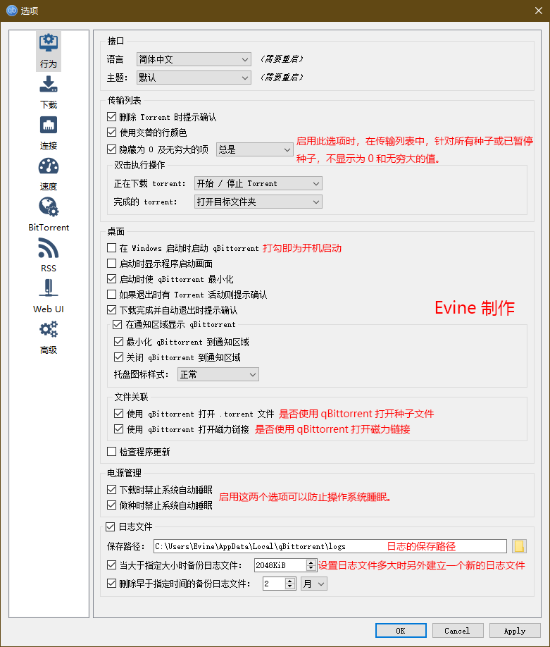
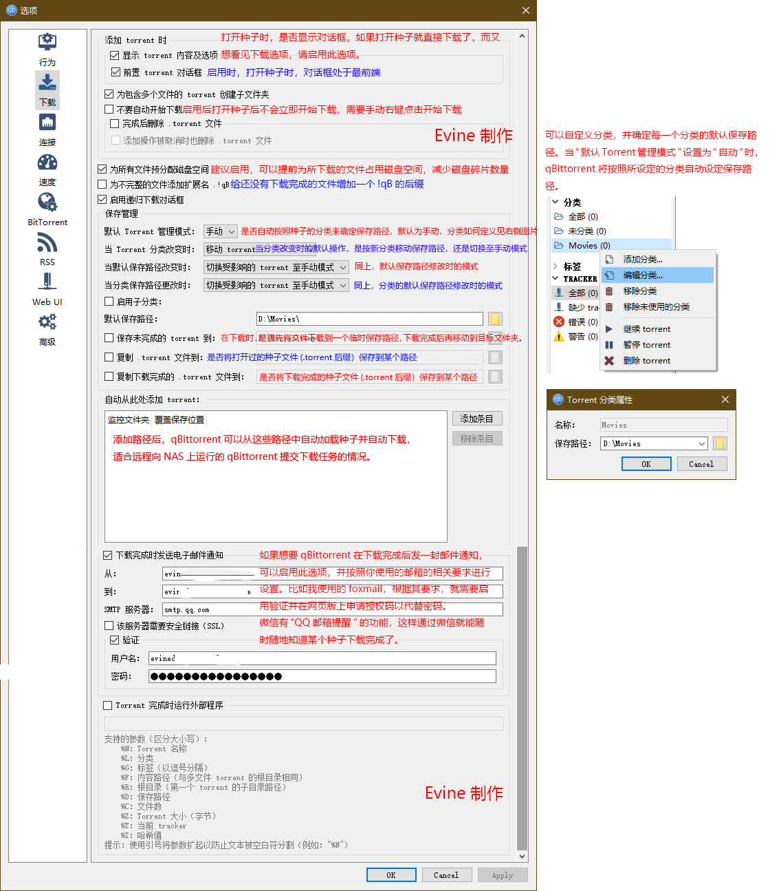
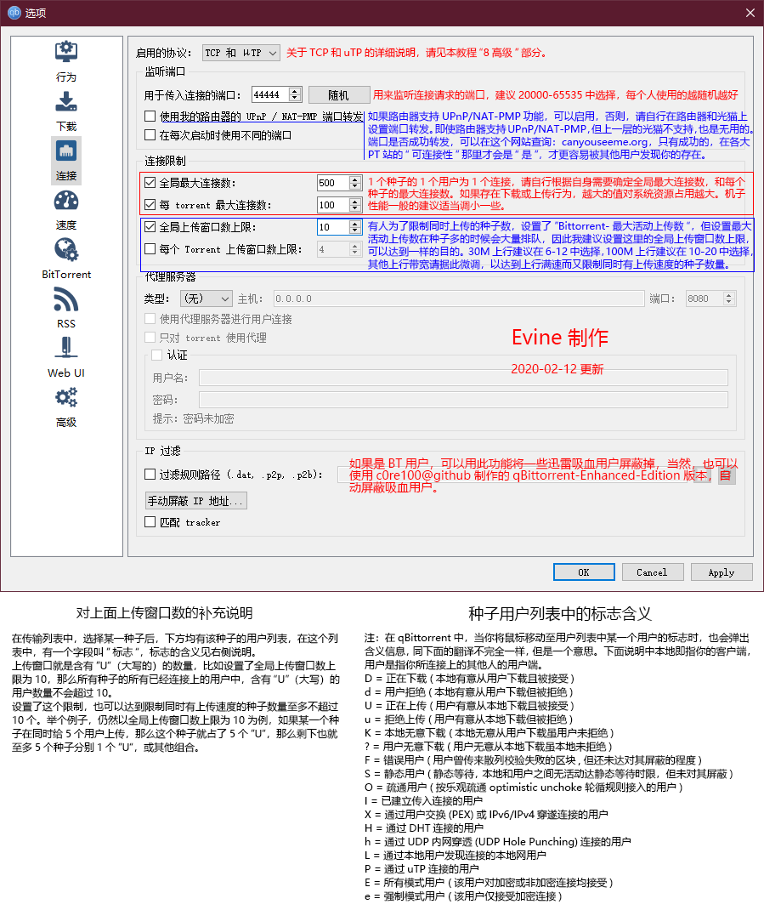
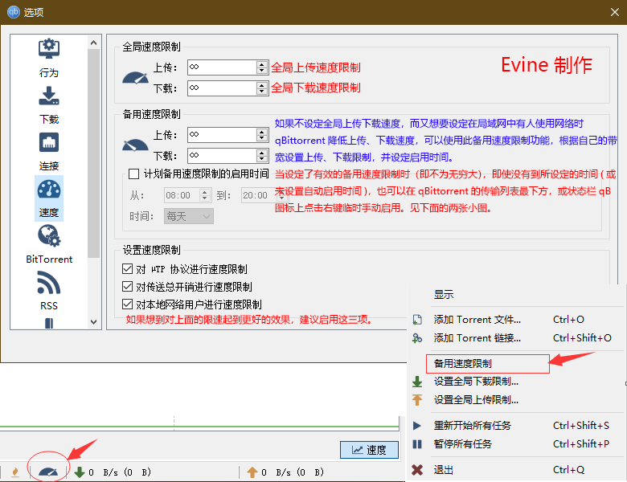
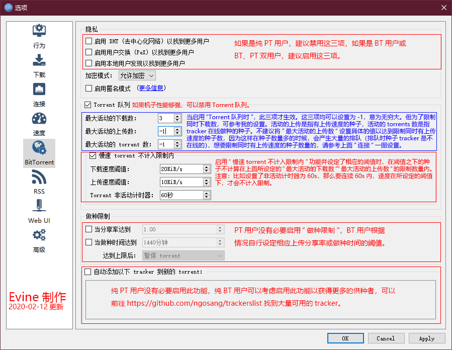
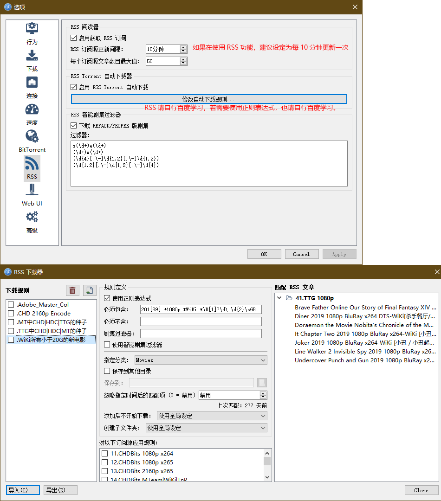
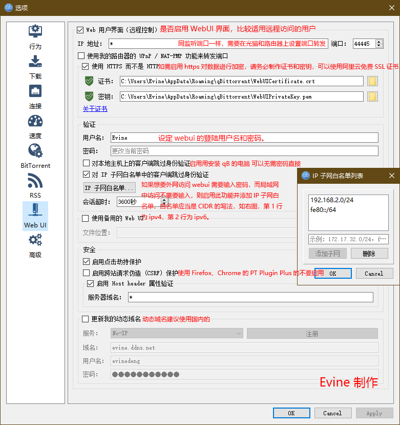
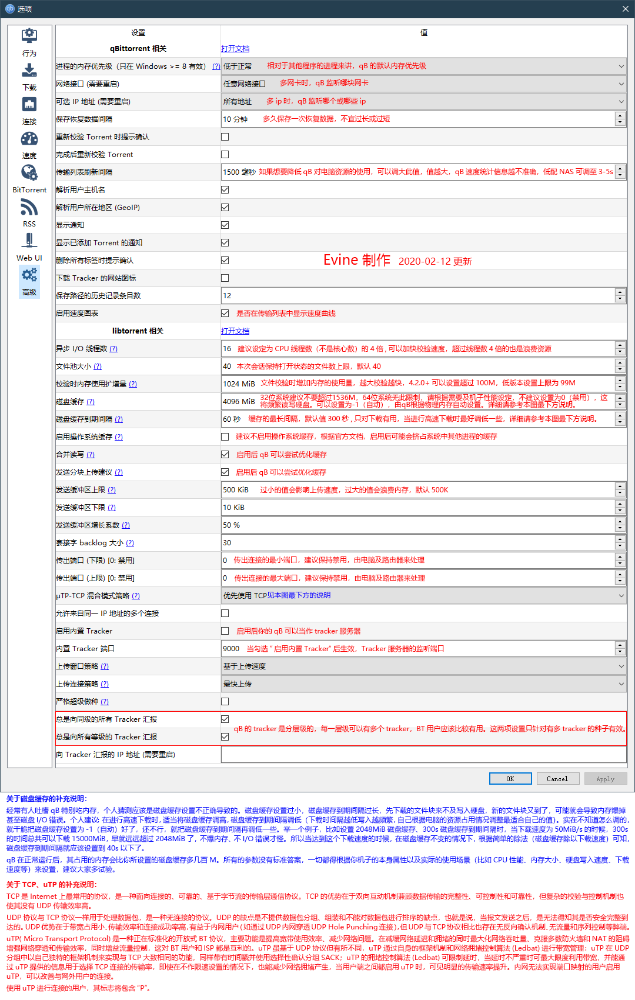

# qBittorrent参数详细设置教程

## 官方介绍

[https://github.com/qbittorrent/qBittorrent/wiki/Explanation-of-Options-in-qBittorrent\#qBittorrentspecific\_configuration](https://github.com/qbittorrent/qBittorrent/wiki/Explanation-of-Options-in-qBittorrent#qBittorrentspecific_configuration)

## Evine 介绍

全文将以目前的最新版v4.2.1为例，进行参数设置，老版本某些功能不太一致，请知悉。

