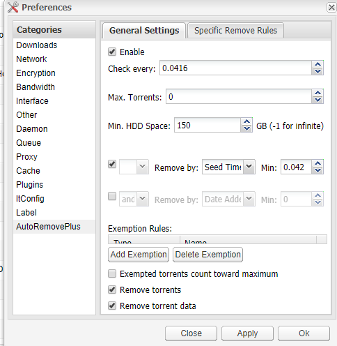

# 自动移除种子及其数据

我很懒，我不想手动删种，我想要程序自动删除某些符合条件的种子。

对于qbittorrent来说只能使用[autoremove-torrents](https://github.com/jerrymakesjelly/autoremove-torrents)

对于deluge来说方案有两种，推荐前者，稳定且不易崩溃，后者崩溃概率较大

​ 1.使用[autoremove-torrents](https://github.com/jerrymakesjelly/autoremove-torrents)

​ 2.使用[autoremoveplus](https://github.com/omaralvarez/deluge-autoremoveplus)

前者的使用文档十分详细，且有中文，本文不复读了

后者的话是deluge的一个插件，星大脚本默认是安装了但是没启用，可以在deluge的webui 设置里勾选此插件，配置还是比较丰富的。

解释一下上图的配置文件，

check every： 每T天检查一次 0.0416为大约一小时

Max.Torrents: 当deluge有N个种子时进行check ，0为无视当前有多少个种

Min.HDD Space：当硬盘剩下M GB 进行check，-1为无视当前有多少空间。

所以结合起来就是，每T天进行一次检查，当且仅当有N个种，硬盘剩下M GB时进行后面对每个种子进行条件判断

条件可以有2条进行组合，比如图上就是移除已做种0.042天的种子。

examption rules指的是部分类型的种子可以豁免删除

exampted torrents count toward maximun指的是豁免种是否统计在 max torrents里

remove torrents指的是是否移除种子

remove torrent data指的是是否移除种子下载的数据。

结合起来该示例图是 当硬盘空间小于150G时每小时检查一次并且删除做种时间超过一小时的种及其数据。

