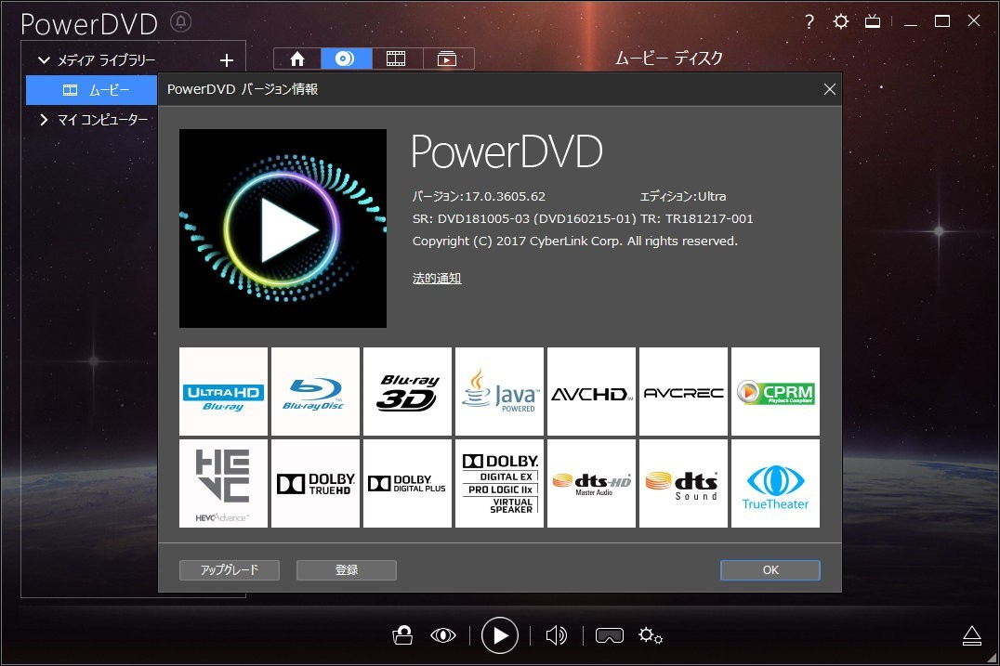
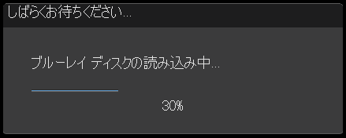
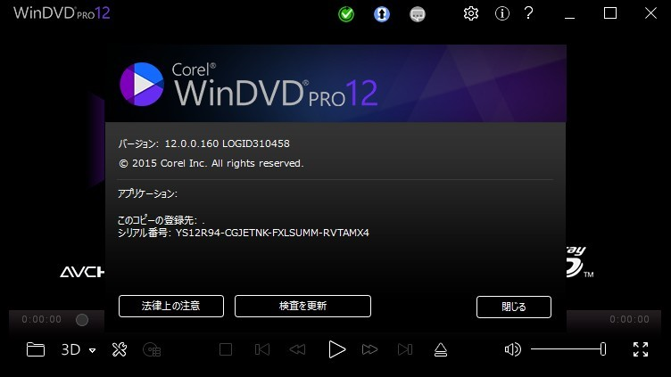
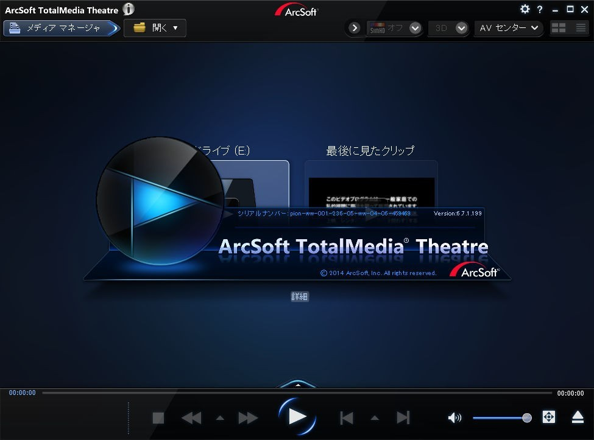
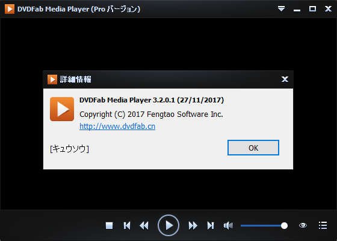
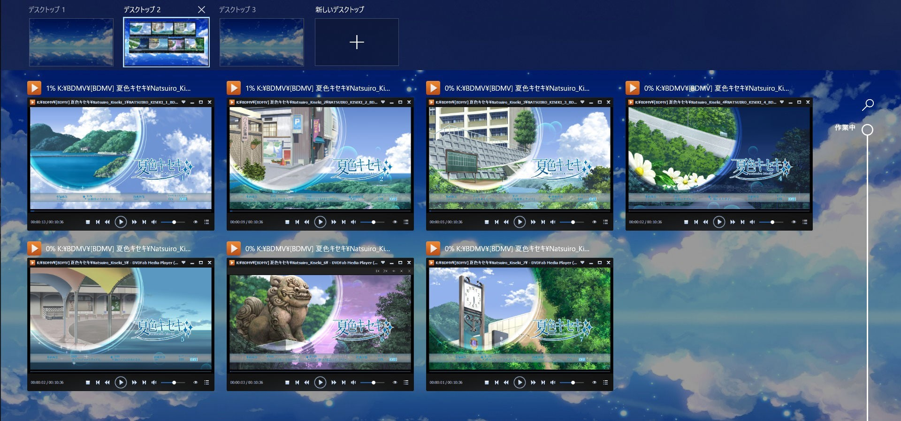
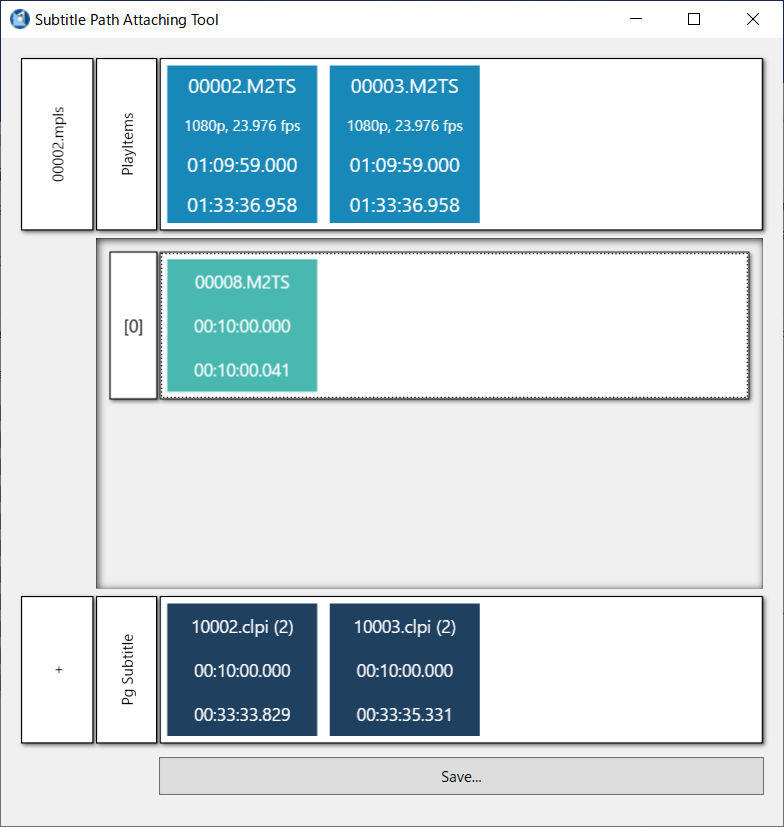
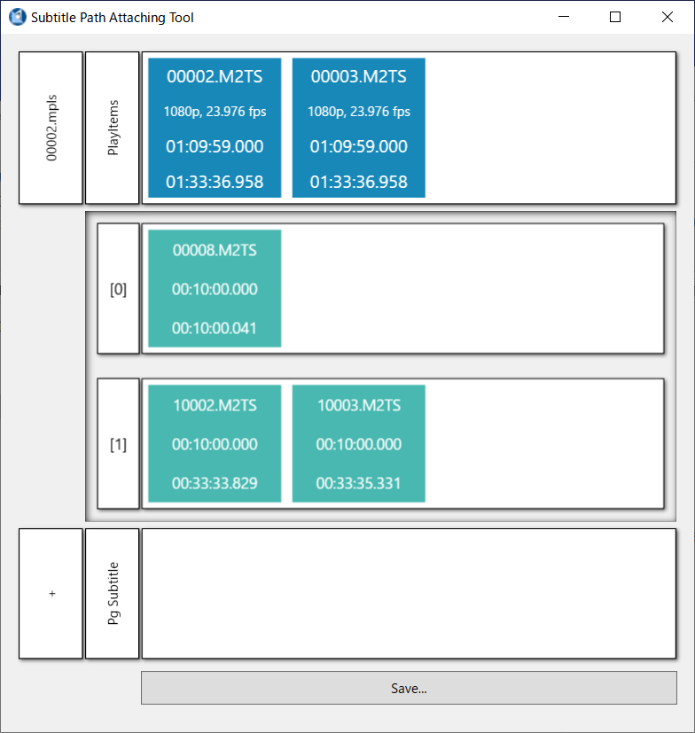
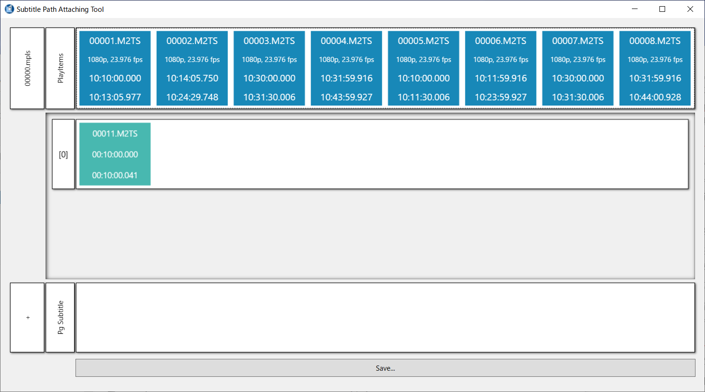

# BDPBC\_MANUAL

## BDPBC\_MANUAL

完整使用蓝光导航播放器的安装和使用,外挂结构的使用以及使用CsmStudio自行制作外挂结构解决字    幕问题.

从折腾原盘开始,较多地花费时间,精力不可避免. 我们的目的是为了看,为了欣赏,为了更好的播放体验. 但被弄坏心情根本就是本末倒置.  因为相关资料较少,文档编辑者还是懒癌患者,很多东西都是靠猜.  没问题 用,有问题改.

完整读完约需要30mins,播放器安装视各人情况而定,从零开始上手CsmStudio约需要30mins.    本文档提到的所有软件的安装包\(不含CsmStudio,独占内容\),以及一些自制的外挂结构, Baidu:

/s/1x8U2HHPCIRRYdZwLNHvzKg PW:4bzr

Telegram\(TG\)群组: [PBC チャット](https://t.me/joinchat/Gj0TVEptp81NpTK8X2qAbg).

把TG当作是体验较好的临时文件储存服务,逐渐会补上上面的所有东西\(软件安装包,自制外挂  结构,等等\)

该TG群组的定位是非公开的,私人的\(不属于任何组织\).  欢迎日系动画原盘爱好者来交流分享经验.

文档的编辑者是日系动画原盘爱好者,但基本上不看外挂结构.  因为技术水平有限,无法提供特别的外挂结构制作帮助.

本文档中所有 u2// 开头的链接,请自行替换并补全.

感谢 CsmStudio 的开发者以及在相关领域的先驱者们. 外挂结构创始者

外挂结构推广者

原盘分享者原盘保种者

本文档的适用对象是日系动画原盘爱好者.

无特殊说明,本文档中所有提到的软件以及附带的安装包都是官方的,并都在文档编辑者的物理机上  安装,使用过,未发现问题. 安装,使用需自行承当风险.

所有内容仅供学习和交流使用,其它目的使用均不受欢迎.

如果你对这个文档的来源毫无头绪,说明你不在适用对象内.  但在遵守上述要求的前提下,可以自由使用该文档及附带的文件.

## 原盘的正常使用方法

首先需要明确的是,我们使用原盘方法是不正常的.  为解决这个不正常的状态,多花费时间/精力不可避免. 下面安装播放器的各种奇怪操作也是因为我们不正常的使用而造成的.

普通的正常的使用方法应该是:

把光盘放入光驱

打开支持的PC播放器,或TV,hardware player,PS3/4/5等按下开始

因为各种各样的原因,多数人无法按这一套走. 同时因为语言的障碍,多数人需要解决字幕问题.

为解决不同平台播放原盘问题,出现了所谓的原盘备份软件,MakeMKV/AnyDVD/DVDFab. 而解决字幕问题的方法之一就是外挂结构\(BD\).

下面的做法和结果都是针对一般情况的总结: 无外加的硬件,Windows10 PC,优雅的使用原盘.

## 外挂结构

外挂结构,让原盘在存的时候能有看的用途     引用自某位前辈

为什么我的眼里常含泪水 因为我对原盘爱得深沉 引用自某位前辈\(改\)

外挂结构是在不改动原始文件\(利于保种,长期留存\),保留完整的蓝光导航,给原盘加上字幕/音轨的黑科  技,U2特产. 严格符合蓝光标准.

想了解历史可以用关键字搜索论坛和翻翻早期外挂结构种的评论区.

通用使用方法参考: u2//forums.php?action=viewtopic&forumid=1&topicid=7021 总结起来就是:

有\*.bat/\*.cmd的,按要求放置目录双击对应\*.bat/\*.cmd.  没的直接把原盘的\*.m2ts硬链接到对应外挂结构的STREAM下\(部分小文件可能不全\),或者硬链接备份大文件后用外挂结构覆盖\(部分小文件也可能不     全\). 注意小文件链接直接覆盖,可能会影响做种.

最不易出问题的外挂结构使用方法:

原盘除了STREAM目录的东西都复制一份,整理成蓝光的文件夹结构,用外挂结构覆盖,再把原盘STREAM目录下的所有xxxxx.m2ts硬链接到外挂结构覆盖后的STREAM目录下.

[方便创建硬链接的工具,LinkShellExtension http://schinagl.priv.at/nt/hardlinkshellext/hardlinksh ellext.html](http://schinagl.priv.at/nt/hardlinkshellext/hardlinkshellext.html)

有一定蓝光结构知识外挂结构使用起来会更顺手,可自行查阅资料或看下下面自行制作外挂结构需要了解  的蓝光结构知识.

## 原盘播放器

观看原盘需要特殊的播放器,靠谱的只有商业的Windows平台\(PD,WinDVD,TMT\).

外挂结构用WinDVD/TMT.  PD不一定能用\(PD折腾外挂结构请保持良好的心态\).

这几个靠谱点的播放器都锁了虚拟化,也只发行了Win版.    目前不存在Mac,Unix/Linux平台直接完整使用蓝光导航的情况.     Mac用户工作或学习中需要Win下软件,如果是用Bootcamp之类的,这几个靠谱的也应该是能用的. 其它平台分个区,安装Win7/8.1之类的也应该能解决.

如果不受字幕的限制,选择范围可以稍微广一些,现在一些靠libbluray的开源/免费播放器对蓝光导航支持    还是不错的,详见下面.

### CyberLink PowerDVD

WinALL,商业,不能用外挂结构,但 真香!真香!真香!

* CyberLink  PowerDVD  Ultra v17.0.1523.60 \(PD17\)            Windows10可直接用,外挂结构支持差\(x 怀疑人生
* PowerDVD\_17.0.3605.62\_Patch\_DVD181005-03               官方的[补丁包](https://www.cyberlink.com/prog/update/v3/update.jsp?fileTypeId=0&PRODUCTNAME=PowerDVD&PRODUCTVERSION=17.0&VERSIONTYPE=Ultra&CHANNEL=iSales&LANGUAGE=JPN&OSREGION=0x7a&SYSTEMLOCALE=0x0411&MAJORVER=17&MINORVER=0&BUILDNO=1523&VENDORNAME=2581&DEVICE&BBProductId=1&BBProdVerId=1274&BBProdVerTypeId=5348&BBnChannel=4&BBnLangId=3&APREGID=e738ba5bcf9304e8864350d43076f5ff&SRTYPE=Retail&DAY_LEFT=0&IsNewBB=1&AB=0&FIRSTLAUNCHDATE=2020%2F01%2F11&GLOBALEXPID=308&CDKey&PatchURLProtocol=clpdvd17dl&SR=DVD160606-01&PATTERNID=3586559&BB_ID=95877&TEST_NO=1-1&INTERVAL=0&TypeId=1&PatchType=5&Category=Enhance&UUID=S-1-5-21-3837843800-2738142123-724906292-1001-E39873B5-CFC2-430E-A6CE-5162F7F85568&UserRegistered=0&affiliate=2581_1274_572_DVD160606-01_95877_3586559_1-1_None_e738ba5bcf9304e8864350d43076f5ff_S-1-5-21-3837843800-2738142123-724906292-1001-E39873B5-CFC2-430E-A6CE-5162F7F85568_0_0_308&utm_campaign=BB_PowerDVD_Enhance&utm_source=BB_Retail&utm_medium=BB). 也可手动检查更新.
* * 可以播放实体碟\(未解密\)
* 可直接播放BD文件夹能应对绝大多数BD 完美支持蓝光导航
* 支持播放symlink后的碟
* 能识别外挂结构,多数情况下不能用外挂结构不能截图
* 不能加载外挂字幕\(PD17\)
* **不支持虚拟化\(VMWare/VirtualBox/Parallels\)**

#### 安装

参考 安装说明.txt

PowerDVD\_17.0.1523.60\_Ultra\_DVD160606-01.exe这个封包可以用7z等解开.

替换解压出来的 Custom.ini，Define.ini, 用setup.exe安装, 替换安装目录的PowerDVD.sim\(这个是Live版的认证文件,PD13-15直接用这一个对应的文件就能用\), 完成

或者直接安装,用keygen.exe破解\(需要右键以管理员运行keygen.exe\)

播放

把原盘文件夹\(卷标,BDMV和CERTIFICATE的上一层目录\)拖入PD,右键选择中文字幕即可. 或者用PD自带的文件浏览器,原盘文件夹或ISO镜像,空格键.

#### 其它

PD的"不能用外挂结构"是一般性来说的.  普通外挂结构,播放列表mpls内第一个m2ts,  挺多时候PD可以正常用.多见于剧场版BD. 外挂结构第二个m2ts开始出现问题.  和码率也有关,一般特效较少,直观来说就是外挂结构文件较小的,挺多时候也能用.

建议补全蓝光结构  补全蓝光结构后,片头的发行商SOPT只需要看一遍.  而且会有下图的提示:  请稍等...蓝光光盘读取中...30% 体验极佳\(

第二次打开时就会直接跳到上次停止的位置. 不用强制看片头的发行商SOPT. Resume功能.

补全蓝光结构,多数情况BDMV\下新建AUXDATA,BDJO,JAR三个空文件夹就可以. 常见普通BD\(HDMV\) 的这3文件夹是空的,UT制种时会略过.

或者用批处理. 新建文本文档,复制粘贴下面的,扩展名改为bat,放到BDMV同级,双击. mkdir BDMV

mkdir CERTIFICATE

cd BDMV

mkdir AUXDATA mkdir BACKUP mkdir BDJO mkdir clpiINF mkdir JAR

mkdir META mkdir PLAYLIST mkdir STREAM del %0

C:\Users\你的用户名\AppData\Local\CyberLink\PowerDVD17\DefaultMember  下记录了详细信息.\Misc\Resuming\_Info.map 蓝光结构完整才可用这个功能.

Resuming\_Info.map 已人类直接可读的方式记录Resume信息,Resumable值取真,TitleIndex/Chapter 这是BD的信息,值全置0,即是主菜单\(Top Menu\). Fingerprint这个字段可能是PD自己定义的,实际试了之后发现,对碟没有严格的唯一性\(显然也不是BD标准里用于纠错的Fingerprint\)

活用这个Resuming\_Info.map,可以跳过片头/尾发行商SPOT. 这个Resuming\_Info.map还记录了你用PD开了多少碟,可以估计看碟数量\(

开启视觉加强后菜单可以渲染地很漂亮!

PD能应对绝大多数奇怪的BD

PD17已知bug,开启Resume功能后一定机率会误报 显卡没达到播放BD要求的最低标准 或 显卡驱动不兼容  ,  这问题不大,直接关了PD17后再重新打开一遍就行.  而且这误报的机率较低,三年多使用只出现过三四次.

PD17之后似乎提供了64位版,估计是为了应对UHD是内存要求\(

更多详细内容, [https://www.videohelp.com/software/PowerDVD](https://www.videohelp.com/software/PowerDVD)

以上的TMT/PD都可以在Rutracker找到对应的内容,验证过hash完全一致. 日 常 使 用 安 利 PD17. 如 PD20, 乱 七 八 糟 功 能 一 堆 ... [https://rutracker.org/forum/viewtopic.php?t=5887436](https://rutracker.org/forum/viewtopic.php?t=5887436) [https://rutracker.org/forum/viewtopic.php?t=5895285](https://rutracker.org/forum/viewtopic.php?t=5895285)

从PowerDVD 7开始试用的,一直到PowerDVD 19,安利PD17更多时候是因为这个版本用的比较多比较顺手\(也是UHD第一版\). PowerDVD 16-19这几个对外挂结构的支持情况差不多.

### Corel WinDVD

WinALL,商业,可用外挂结构

Corel WinDVD Pro 12.0.0.90 SP5 \(WinDVD\)

可以播放实体碟\(未解密\)

不能直接播放BD文件夹,可配合DVDFabVirtualDrive

能应对绝大多数BD 完美支持蓝光导航

支持播放symlink后的碟\(条件限定,DVDFabVirtualDrive不认symlink,但有正确的\*.miniso可

挂载和播放\)

能识别外挂结构,外挂结构支持好,Windows10可直接用

不能截图

不能加载外挂字幕

**不支持虚拟化\(VMWare/VirtualBox/Parallels\)**

安装

解压直接安装\(Setup.exe\),需要正常的网络连接,否则无法激活. 网络连接可用,安装完成即激活.

播放

[WinDVD无法直接播放文件夹,搭配 DVDFabVirtualDrive\(免费软件,官网 https://ja.dvdfab.cn/virtual- drive.htm \)挂载后可比较方便播放.](https://ja.dvdfab.cn/virtual-drive.htm)

安装启动DVDFabVirtualDrive,默认最小化托盘区. 右键 生成.miniso镜像\(M\) ,目录选择到链接好的外挂结构对应卷的卷标\(能看见BDMV和CERTIFICATE\), 开始\(S\) 便会挂起对应卷. 用WinDVD播放,右键选择中文字幕即可.

#### 其它

安装会默认添加检查更新的计划任务. 关了也无所谓,更新的内容对外挂结构没啥影响. 现在最新的是[SP6,正常联网就能直接安装. 或者手动 http://dwnld.windvdpro.com/updates/v12/WinDVD\_Pro\_12](http://dwnld.windvdpro.com/updates/v12/WinDVD_Pro_12_SP6.exe)

[\_SP6.exe](http://dwnld.windvdpro.com/updates/v12/WinDVD_Pro_12_SP6.exe)

依旧没发现WinDVD修改界面语言的接口,注册标没找到关于语言设置的值,官方也只提供了繁体中文.    非繁体中文系统的用户,安装前把 .\Lang\CT 目录下其它语言包都删了,估计就可用繁体中文版.

DVDFabVirtualDrive在生成miniso时不认symlink,提前准备好对应miniso后可用. 这个不是官方的安装包. 来源不明. 实际使用未发现安全问题.

更多详细内容, [https://www.videohelp.com/software/WinDVD](https://www.videohelp.com/software/WinDVD)

### Arcsoft TotalMedia Theatre

WinALL\(Win8.1/10,条件限定\),商业,可用外挂结构

Arcsoft  TotalMedia  Theatre v5.0.1.80 \(TMT5\)           Windows10不可用,外挂结构支持好

Arcsoft  TotalMedia  Theatre v6.7.1.199 \(TMT6\)           Windows10不可直接用\(条件限定\),打上补丁部分机器可用,外挂结构支持好

可以播放实体碟\(未解密\)

可直接播放BD文件夹能应对绝大多数BD 完美支持蓝光导航

支持播放symlink后的碟

能识别外挂结构,外挂结构支持好,Windows10不能直接用\(TMT6,条件限定,打补丁后,部分可       用\)

不能截图

不能加载外挂字幕

**不支持虚拟化\(VMWare/VirtualBox/Parallels\)**

安装

参考 说明.txt/!!!READEM.TXT

似乎不重启系统也可行,安装完之后最好马上删除ArcCtrl.sys,有些机子没删蓝屏了..重启之后删也比较麻   烦.

Win10使用TMT得花时间折腾,一些驱动问题很麻烦.   善用论坛的检索功能,有许多相关的讨论贴. 图省事放外挂结构还是直接用WinDVD吧.

播放

把原盘文件夹\(卷标,BDMV和CERTIFICATE的上一层目录\)拖入TMT6,右键选择中文字幕即可

#### 其它

Windows10补丁,部分机子可用,似乎和显卡有关. 同样可用于更新过后的Win8.1 参考: [https://nnmclub.to/forum/viewtopic.php?p=9486156\#9486156](https://nnmclub.to/forum/viewtopic.php?p=9486156&9486156)

参 考 :   u2//forums.php?action=viewtopic&topicid=6969&page=p135837\#pid135837 原文:

**1. Установить программу как и раньше по инструкции из файла со всеми вытекающими , перегрузить железо , активировать , не запускать .**

2. Под Win 10/64 и не только , заменить файл C:\Program Files \(x86\)\ArcSoft\TotalMedia Theatre 6 , на uTotalMediaTheatre6.exe 6.7.1.199 он в архиве ниже .

3. С помощью Unlocker или другими методами удалть C:\Windows\System32\drivers\ArcCtrl.sys , это драйвер защиты, нужен для оригинального uTotalMediaTheatre6.exe  

PS. Запустить и пользоваться , win 10/64 теперь все работает отлично.

大意\(机翻润色\):                                                                        1.按照文件中所给内容的指示安装程序，重启电脑，并破解。

2. 替换 C:\Program Files \(x86\)\ArcSoft\TotalMedia Theatre 6\ 中的 uTotalMediaTheatre6.exe

3. 使用Unlocker或其他方法删除 C:\Windows\System32\drivers\ArcCtrl.sys，这是原uTotalMediaTheatre6.exe所需的保护驱动程序

附注:运行和使用，win10/64现在运行得很好。

如果有使用过TMT,可以花些时间折腾折腾,确实有部分人能用. 否则建议直接用WinDVD看外挂结

构,WinDVD仍在维护,TMT已停止更新. 而且WinDVD比TMT还更省资源,ui确实难看了点,闹心,用用应该能习惯..

更多详细内容, [https://www.videohelp.com/software/Arcsoft-TotalMedia-Theatre](https://www.videohelp.com/software/Arcsoft-TotalMedia-Theatre)

### DVDFab Media Player

WinALL+macOS,商业,不能用外挂结构

DVDFab Media Player 3

能识别外挂结构,不能用外挂结构

可截图菜单,主菜单\(Top Menu\)和弹出菜单\(Popup Menu\)

可直接播放BD文件夹. 能应对多数普通的BD 蓝光导航支持有些问题

可直接加载ass/ssa等字幕,可调轴/偏移,正负10s,精度0.5s. 但特效微妙fade都能看出违和感,

默认时间轴有轻微偏移. 只能从对应mpls从头加载, 呼出弹出菜单时字幕强制关闭.  

可通过拖动进度条跳过片头/尾发行商SPOT,直接进入主菜单.

DVDFab Player 5

部分功能同DVDFab Media Player 3

增加了快捷键\(可自定义\),主菜单\(Top    Menu\)和弹出菜单\(Popup    menu\)可用快捷键呼出5比3更容易卡,闪退. 不知道是不是我的错觉...3到5改了个名,UI也变得更加现代了. 而且比较极端的高频率通过弹出菜单\(Popup Menu\)跳转易出现,音画不同步甚至黑屏.. 相同情况下PD/TMT/WinDVD包括QC在内都没这些问题

去除了跳过片头/尾发行商SPOT\(进度条拖动了也跳不了\)

DVDFab Player 6

加入了一些根本用不到的功能,界面还不够简介,和5差不多. 没找到稳定的crack,也就没多试.

#### 安装

官方的安装包直接安装,然后用对应的 \*.cmd 激活.

DVDFab Player 5的激活\*.cmd 来自nnmclub论坛, DVDFab Media Player 3的激活\*.cmd是临时写的,KEY取自Rutracker的3.2.0.0版\(俄文的repack安装包,直接安装比较麻烦\),DVDFab Media Player 3.x

系列通用,按其中注释,出自和Windows10TMT补丁同一个论坛,nnmclub. DVDFab Media Player 3.x系列只需要对应的一个注册表键值就可以激活,发现和这位会员提供的一致,u//forums.php? action=viewtopic&topicid=9797&page=p94114\#pid94114

另外附了一份 DVDFab Media Player 3\(v3.2.0.1\)免安装版,解压,用\*.cmd激活,就能直接用. DVDFab Media Player不能用外挂结构,加载ass/ssa字幕要求正片单文件才能完整载入. 这种情况PD都能播一些外挂结构. DVDFab Media Player还是有挺多问题的,尽量用PD. 不过可以把它当作一个安装/操作简单的菜单截图工具...

官方安装包的镜像, [https://www.videohelp.com/software/DVDFab-Media-Player/old-versions](https://www.videohelp.com/software/DVDFab-Media-Player/old-versions) [DVDFabMediaPlayer3102.exe](https://www.videohelp.com/download/DVDFabMediaPlayer3102.exe) 安装好后点更新,就能只动更新到3最新也是最后一个版本v3.2.0.1 [DVDFabMediaPlayer5032.exe](https://www.videohelp.com/download/DVDFabMediaPlayer5032.exe) 自解压gzip封包,直接解压后patch也能用.写临时文件比3多...

#### 播放

DVDFab Media Player 3默认简单模式,无菜单,到设置里把播放模式改成菜单模式CTRL+F直接选原盘文件夹\(卷标,BDMV和CERTIFICATE的上一层目录\)就行.

#### 其它

因为没找到比较干净的DVDFab Media Player 2.x安装包,2.x系列没试用. 不过估计也差不多...

这里特别把DVDFab Media Player拎出来是因为这是少数跨平台的商业蓝光播放器,而且背后有DVDFab支持,商业软件未来可期待. 版本越更新越有样子了\(如5/6去除了跳过片头/尾发行商SPOT功能\). 八成啥时候不能截图了,涨价了,就能和前仨相提并论惹\(摊手

macOS上似乎还有个 [Mac Blu-ray Player Pro](http://jp.macblurayplayer.com/download.htm) 支持完整蓝光导航,能截图,但不能用外挂结构.

DVDFab Media Player的截图功能,建议配合外部工具使用,如win+prt sc之类的,它自带的右键菜单里的截图\(IG菜单截不了\)

DVDFab Media Player对最普通原盘\(HDMV\)导航\(菜单\)的支持仍不够完善.比较明显的有以下几点:

另起一页的菜单之间跳转时会短暂黑屏一下\(这里 另起一页的菜单 直观的理解就是,跳转后背景变了,一般背景音乐也会变的这种情况\)

使用鼠标导航时,不能很好的捕捉箭头的位置.一些菜单按键无法根据箭头的移动而由普通状态\(normal\)变为选择状态\(select\). 这里非常明显的情况是通过鼠标导航时 左上左下右上右下 的操作. 体验极差.

通过菜单跳转章节太急会出现音画不同步甚至黑屏...  

上面提到的问题DVDFab Media Player 3.x/5.x/6.x均存在,而PD/TMT/WinDVD包括QC以及Kodi, VLC在内都不会出现.

DVDFab Media Player 3还有个比较奇怪的功能,可以多开,同时放多部原盘,多开补番\(雾\),比如这样:

看外挂结构推荐WinDVD/TMT,其它情况直接用PD

DVDFab Media Player系列推荐DVDFab Media Player v3.2.0.1,功能较全而且干净,可以作备用,或者作为一个安装简单的菜单截图软件..

关于UHD的支持,我硬件没达到UHD的最低要求也就没试了,不过好像UHD有授权的只有PD和WinDVD...嗯...

更多详细内容, [https://www.videohelp.com/software/DVDFab-Media-Player](https://www.videohelp.com/software/DVDFab-Media-Player)

### Kodi, VLC

ALL,免费,不能用外挂结构

不能识别外挂结构,不能用外挂结构.                                       Kodi可截图菜单,主菜单\(Top Menu\)和弹出菜单\(Popup Menu\).

VLC可截图菜单,主菜单\(Top Menu\),但不能呼出弹出菜单\(Popup Menu\)也无法截图. 可直接播放BD文件夹.

Kodi显示可直接加载ass/ssa等字幕,试用发现加载不了.可调轴/偏移,正负60s,精度0.001s.   可无视区码和跳过片头/尾发行商SPOT

也能应对挺多普通的BD

蓝光导航支持有些问题,但没上面提到DVDFab Media Player的问题

不想用破解软件又对蓝光导航有需求或者非Win用户,似乎只有这俩了. Kodi是媒体中心软件,对PC用户不是很友好,得花时间熟悉操作.

VLC不能呼出弹出菜单\(Popup Menu\),这不是和DVD一样了么 但播放列表做得很漂亮,可读取并显示JAR\DL下Logo和bdmt\_jpn.xml里的官方名,这很讨人喜欢.   VLC的贡献是在libbluray上,蓝光导航\(菜单,Blu-ray playback\)受制于蓝光联盟\(Blu-ray Disc Association\)和BD Format/AACS/BD+... 没法开源,开源播放器能用蓝光导航本就是异端...外挂结构基本不用想了,但哪天把弹出菜单加上还是可以吹的~

HP: Kodi   [https://kodi.tv/](https://kodi.tv/)           VLC [https://www.videolan.org/vlc/](https://www.videolan.org/vlc/)

VLC可已通过下面的补丁支持部分未解密的BD播放,不过很长时间没更新了,而且支持我们小圈子里的碟    应该很少.  

[https://vlc-bluray.whoknowsmy.name/](https://vlc-bluray.whoknowsmy.name/)

### Leawo Blu-ray Player

WinALL+macOS,商业,播放功能免费,不能用外挂结构

不能识别外挂结构,不能用外挂结构.

可截图菜单,主菜单\(Top Menu\)和弹出菜单\(Popup Menu\).

可直接播放BD文件夹.  不可直接加载ass/ssa等字幕,可调轴/偏移\(内封字幕\),正负9s,精度0.1s. 可无视区码和跳过片头/尾发行商SPOT

也能应对挺多普通的BD,但很容易原因不明闪退,体验差

蓝光导航支持有些问题,但没上面提到DVDFab Media Player的问题, 不可用鼠标控制导航, 通过键盘或者虚拟按键控制导航反应还非常慢.

官方安装包的镜像, [https://www.videohelp.com/software/Leawo-Blu-ray-Player/old-versions](https://www.videohelp.com/software/Leawo-Blu-ray-Player/old-versions)

没记错的话,2版本之后加入了BD Copy功能,需要付费. 这软件比较奇怪,还特容易闪退,功能也基本时是DVDFab Media Player的子集... 商业软件识别不了外挂结构可海星,不推荐. 截图菜单可以用 DVDFab Media Player 3替代

### Scenarist QC

Scenarist系列软件,用于调试制作完成的BD.

除不能适应外挂结构,以上软件有的蓝光导航功能可是说是一应俱全\(菜单没PD渲染地漂亮..\)  能截图,能无视区码,能跳片头/尾发行商SOPT. 对外挂结构兼容情况和PD差不多.

界面不友好,且各种小问题也较多,不适合日常观看使用.

安装和上面的比要麻烦一些. 有兴趣可以折腾折腾. 两个常见版本的安装也附带了.

换机Scenarist系列软件一般也都会装,我不知道安装QC那些是必要的了, 复制wsock32.dll, hooksent.dll,安装Sentinel Protection Installer,再安装QC,启动后用keygen.exe算号. 好像是这个流程.

## 使用CsmStudio解决原盘字幕问题

挂着种,收藏原盘时,可随时观看,有字幕,有菜单.

首先祝贺下,最重要的一步已经做完了,可以打开安装好的播放器,看看能不能放原盘.

因为硬件以及各种原因,有不少会员安装不好原盘播放器,或者安装了播放还是有各种问题.  这没有其它方法,只能自己解决.  不过可以看看是否有人遇到过类似问题?  用啥方法解决的?  如果对字幕没要求,用不了可以换其它几个,还有选择余地.    对字幕有要求,要用外挂结构,目前只能在TMT/WinDVD里选...\(或者不用外挂结构,换其它思路,如textST?或者加流重灌\)

外挂结构做法有好几个时期. 使用CsmStudio非常方便,且上手简单,能应对绝大多数情况. 感谢开发者!  

需要说明的是,外挂结构是严格符合蓝光标准的,播不了不是外挂结构的锅而是播放器的锅.    因为各种原因,靠开源libbluray的播放器在蓝光导航支持上可以说是没有未来\(上面提到的开源或是免费的连外挂结    构都识别不了,更别说播放了\). 另外,对外挂结构支持最好的依旧是TMT\(x 都是Win10的锅

下面是根据18年初对90个外挂结构\(约占当时全站外挂结构种1/5\)的统计,得出的外挂结构制作方法.     侧重于自用. 很多做法解释不了为什么需要这么做,而是这么做可用,所以这么做... 很多结论也都是实际操作的总结. 如果出现,请多尝试不同的做法.

发布用外挂结构建议加下U2CSM的相关群,了解制作方法/注意事项.

再次感谢 CsmStudio 的开发者以及在相关领域的先驱者们.

\*   对蓝光导航没要求,可直接用MPC-BE/VLC/MPC-HC/PotPlayer之类播放\BDMV\PLAYLIST\\*.mpls 加载字幕也比较方便.

\*   用mpls播放可以处理肉酱盘\(一集被分成了多个m2ts\).

\*   多音轨\(一般指评论音轨\)一般会有单独的单集的mpls,这个也可以用于加载字幕.

\*   PotPlayer是我唯一知道的可以给字幕调轴的播放器,精度0.5s,无上下限.

\*   但字幕问题解决后,制作外挂结构基本不花时间.

### 了解蓝光结构

这里只简单介绍下CsmStudio法制作外挂结构需要的蓝光结构知识, 同时也可用于普通外挂结构的使用.

#### 蓝光结构\(Blu-ray Disc Folder and File Structure\)

\BDMV\index.bdmv

\BDMV\MovieObject.bdmv

\BDMV\PLAYLIST\xxxxx.mpls

\BDMV\clpiINF\xxxxx.clpi

\BDMV\STREAM\xxxxx.m2ts

\BDMV\AUXDATA\\*

\BDMV\BACKUP\\*

\BDMV\BDJO\\*

\BDMV\JAR\\*

\BDMV\META\\*

\CERTIFICATE\\*

上面加粗五行的内容是正常播放和外挂结构正常使用所必须的\(HDMV\).

BDMV下AUXDATA/BDJO/JAR一般是空目录,UT制作种时会略过. 没空文件夹也不会影响播放. 如果是用BD-J技术制作的BD,这仨目录非空,删了会影响播放.

CERTIFICATE一般也非空,没空文件夹或者原来有删了也不会影响播放.                                   BDMV下BACKUP是index.bdmv/MovieObject.bdmv/PLAYLIST/clpiINF的备份,发布者不删一般   不会是空目录,对播放没有任何影响.

BDMV下META多数情况也非空. 空或者原来有删了也不会影响播放. 非空的话下面DL文件夹下一般有一大一小的两张图\(logo\)和一个\*.xml\(记录该盘的信息,如title之类的. 比较关注的是  

&lt;di:name&gt;...&lt;/di:name&gt;这一段记录的官方的碟名. 如果你用MPC-BE/VLC/PotPlayer之类的播放BD播放列表mpls,标题就是从这里读取的\)                                                                      xxxxx代表的是五位数字,取值没有特殊意义,不连续也没有问题.

如果BDMV下JAR目录非空,那一般可以认为这碟是用了BD-J制作的\(严格证明需要用BDedit/BDInfo 之类的软件扫\),外挂结构正常使用和正常播放需要这几个目录的东西.

所以最不易出问题的外挂结构使用方法是:

原盘除了STREAM目录的东西都复制一份,整理成蓝光的文件夹结构,用外挂结构覆盖,再把原盘STREAM目录下的所有xxxxx.m2ts硬链接到外挂结构覆盖后的STREAM目录下.

[方便的创建硬链接的工具,LinkShellExtension http://schinagl.priv.at/nt/hardlinkshellext/hardlink shellext.html](http://schinagl.priv.at/nt/hardlinkshellext/hardlinkshellext.html)

#### 可能会有的其它目录

\AACS\\*

\MakeMKV\\*

\!ANY\\*

\disc.inf

\FAB!\\*

\dvdfab.miniso

下载到的原盘AACS一般不会有,这是原盘AACS加密技术的目录,用软件解密出来后一般不会附带.     下面五个是MakeMKV/AnyDVD/DVDFab这仨软件解密残留的东西,对播放没有任何影响.

#### HDMV\(High Definition Movie Mode\)和BD-J\(Blu-ray Disc-Java\)

这是蓝光原盘支持的两种高清图形格式\(蓝光导航,菜单相关\),多数情况下我们碰到的都是HDMV\(BDMV    内一般是两个\*.bdmv+5个文件夹或两个\*.bdmv+4个文件夹,META不一定有\)

HDMV格式固定比较死板,也因此修改菜单之类的容易上手,BD-J相比HDMV能支持更多的功能,如联网\(BD-LIVE\),本地储存\(BD-GAME\),以及颜色更加丰富的图像菜单按键之类的,这些HDMV实现不了.也导致BD-J玩DIY比较麻烦.

HDMV和BD-J可单独或混合一起使用. 我们小圈子里的碟一般都是 纯HDMV 或者 HDMV和BD-J混合 , 外挂结构都能很好的支持这两种模式.

### 软件相关

CsmStudio

CompilerTest ass --&gt; pes+mui BdMuxServer pes+mui --&gt; clpi+m2ts CsmGuide mpls+clpi --&gt; 新 mpls

Aegisub ass\(s\) --&gt; 新ass\(s\) 调轴/拆分/合并

FontLoader.exe 临时载入字体工具. 把字体拖至FontLoader.exe即载入,关闭即自动卸载载入的字体。

### 可能会有用的内容

CsmStudio是U2独占内容,请到对应帖获取完整的CsmStudio u2//forums.php? action=viewtopic&topicid=8930

[LinkShellExtension\(硬链备份,不影响保种\) http://schinagl.priv.at/nt/hardlinkshellext/hardlin kshellext.html](http://schinagl.priv.at/nt/hardlinkshellext/hardlinkshellext.html)

Aegisub [http://www.aegisub.org/](http://www.aegisub.org/)

[Vmoe字幕组汉化的Aegisub中文文档,可用于Aegisub入门 https://aegi.vmoe.info/docs/3.2/M ain\_Page/](https://aegi.vmoe.info/docs/3.2/Main_Page/)

SrtEdit 这个合并字幕的操作比较方便 [https://sourceforge.net/projects/srtedit/](https://sourceforge.net/projects/srtedit/) FontLoader    项 目 页    [https://bitbucket.org/cryptw/fontloader/](https://bitbucket.org/cryptw/fontloader/) FontLoaderSub  GitHub 项 目 页  [https://github.com/yzwduck/FontLoaderSub](https://github.com/yzwduck/FontLoaderSub) 超级字体整合包 [https://share.dmhy.org/topics/view/516705\_XZ.html](https://share.dmhy.org/topics/view/516705_XZ.html)

### 准备字幕

最繁琐,最花时间的一步,目前不可用工具替代,只能人工操作

字幕区 u2//subtitles.php 下载对应字幕检查字幕是否有过多特效

这一步在CsmStudio法制作外挂结构下,不是必要的. CsmStudio法制作外挂结构对特效字幕的支持很好. 一般下载到的带点特效的字幕都可以完美支持. 偶尔有特效较多的字幕,直接做也只是特效的地方会字幕显示不流畅,高发于OP/ED,自己看不在意的话根本不用理它.

没特别好的判断方法,经验上来说,普通的24mins左右的ep字幕,  ass字幕体积小于500KB,  文本编辑打开ass字幕不超过3000行, 生成的clpi+m2ts体积小于50MB, 都是没啥问题的\(参考,有没问题实际试一下就知道了\)

注意:去特效也被认为是修改字幕.  自用无影响,但分发需要说明情况,部分有特殊要求的可能需要联系字幕组获得许可.

去特效应该需要较高的技巧...也没必要在一棵树上吊死,直接换其它组的作品比较方便... 至\BDMV\STREAM\下 于对应 xxxxx.m2ts 调轴

使用CsmStudio制作外挂结构,单m2ts只能对应单字幕,但单字幕可以对应多段m2ts

下面调轴做法均是为了适应这点

CsmStudio的存在已经把外挂结构制作简化了很多很多

情况\(1\) 单m2ts单集,多个字幕,且字幕和m2ts唯一对应. 简单调轴或不需要调轴就能和字幕一一对应.

某季番Vol.01

00000.m2ts 是发行商SPOT, 00001.m2ts 是菜单背景, 00002.m2ts-00003.m2ts 是本篇的一二集, 00004.m2ts之后是小文件...

最常见情况,如近几年的季番.

方便易处理,调完轴后直接到下一步. 情况\(2\) 多m2ts单集,单字幕\(肉酱盘\)

某剧场版本篇

00000.m2ts 是发行商SPOT, 00001.m2ts 是菜单背景, 00002.m2ts-00009.m2ts 是本篇的片段,合起来是完整电影,和单字幕对应, 00010.m2ts之后是小文件...和PV/CM/SPOT/采访/访谈等...

多见于剧场版/动画电影

直接用本篇第一个m2ts,上面例子里就是00002.m2ts调轴. 或用对应播放列表\(MPLS\)调轴,找播放列表\(MPLS\)见下面. 调好轴后下一步. CsmStudio/CompilerTest可完美处理这种情况\(肉酱盘\)  

情况\(3\) 单m2ts多集,多个字幕

某老番BDBOX

00000.m2ts 是本篇的ep1-ep4, 00001.m2ts 是菜单背景, 00001.m2ts之后是小文件... 和PV/CM/SPOT/采访/访谈等...

多见于较老番剧的BDBOX/不是半小时一集的动画 最麻烦的情况,需要调轴并合并字幕. 简便方法未知.

1.        无论用啥方法,能把4个字幕合并成一个并对上时间轴就行.  相对Aegisub来说,和并字幕SrtEdit要方便一些.

2.        或者先校对ep01时间轴,对好后找播放列表\(MPLS\)方法见下面. 用播放器如MPC- BE或Mediainfo类似软件获取播放列表\(MPLS\)的详细章节信息. 找到ep02开始的具体时间,Aegisub直接平移后,挂到00000.m2ts校对.ep03/04同理. 最后把4个字幕用文本编辑器之类合并成一个. 字幕样式也直接复制即可,重复不会影响.  获取播放列表\(MPLS\)的详细章节信息是为了方便调轴,相当多情况下,一步就可以到位.

情况\(4\) 其它情况

上面仨能涵盖多数情况,偶尔会有前面三个里两个或三个一起出现某番BD Vol.01

00000.m2ts 是发行商SPOT, 00001.m2ts-00008.m2ts 是本篇的片段, 但每ep被分成里 两 个 m2ts, 且 字 幕 是 整 ep 的 . 00001.m2ts-00002.m2ts 是 ep01,00003.m2ts- 00004.m2ts是ep02, 00005.m2ts-00006.m2ts是ep03,00007.m2ts-00008.m2ts是ep04,00008.m2ts之后是小文件...和PV/CM/SPOT/采访/访谈等...

上面这个例子是第一种和第二种情况同时出现. 可以

1.        字幕按m2ts切割,如果字幕单集时轴每问题,只需要平移4次,且可一步到位.

2.        或者直接交给 CsmGuide处理 ,多个肉酱盘拼接. 需调整单集单字幕文件时轴,如00001.m2ts+00002.m2ts调至和ep01字幕一致.

### 准备字体

字幕区下载的字体多数情况下不带字体. 为字幕正确显示需要安装对应的字体.

可至share.dmhy.org对应字幕组的发布页,下载对应字体包.   部分字幕内封mkv也会一起封入字体, 可用MKVExtract拆出字体.

或者Aegisub的fontcollect找到缺失字体至超级字体整合包或其它字体镜像下载缺失字体. 用FontLoader.exe载入字体后进入下面一步. \(FontLoaderSub.exe筛选字体比较严格,类似

Std\(N\),Pro-X\(N\),这种字体名不同就不加载,而FontLoader.exe挂起来还是能用的. 可以先把字体扔到FontLoader.exe上,挂起来. 再把字幕扔 FontLoaderSub.exe 上检查字体是否加载完整\)

在外挂结构成品不分发,仅自用时,   字体可以改成已有的/自己喜欢的,简化步骤 多数BD官方字幕用的是等幅字体,长时间观看不容易累,而且也比较简约和美观. 偶尔用到的时候,我一般会用下面这几个\(也一起附带了\):

中文正文: 方正准圆\_GBK \(FZZhunYuan-M02\) 中文标题/注释: 方正粗圆\_GBK/或同正文

日文正文: モトヤLマルベリ3等幅

日文标题/注释: モトヤLシーダ3等幅/ＭＳ ゴシック/G-OTF-GShinMGoPro-Medium/或同正文

微软雅黑/宋体之类也挺不错,但边角不圆看着有些别扭,和官方字体不是很搭...  

### CsmStudio

到上一步做完,普通播放器已经可以看了.  但CsmStudio这两步熟悉后基本不花时间.   即使完全没BD结构概念,半小时应该也能上手.

啥?不想再折腾惹?有字幕能看就行?

窝说不了什么,只能露出

#### CompilerTest

配置好CsmStudio

主要是 CompilerTest.exe.config 内的文件路径信息. 这里有配置好的可以直接用u2//forums.php?action=viewtopic&topicid=8930&page=p109131\#pid109131 或 者按需求自己修改.

[需VC++2015 Redist\(Win10一般都是安装了的\) https://www.microsoft.com/zh-CN/dow nload/details.aspx?id=48145](https://www.microsoft.com/zh-CN/download/details.aspx?id=48145)

设置的临时文件目录需要有4G以上空间,否则会报错. 如果用的是上面那个配置好的,就是CsmStudio的同目录. .\Temporary\目录下会产生临时文件,需要定时手动清理.

找到原盘对应正片的播放列表\*.mpls\(为了后续操作方便,建议用LinkShellExtension等工具将整    个种备份一遍,把备份后的各卷BDMV的上级目录提到同一级\)

打开 CsmGuide.exe ,将第一卷原盘目录下\BDMV\PLAYLIST\\*.mpls 从第一个00000.mpls 开始依次拖入到PlayItems前面的加号. 边拖入边观察PlayItems行,直到出现刚才调轴时的m2ts对应的五位序号.

如\(1\)应该为00002.m2ts,00003.m2ts,... \(2\)应该为00002.m2ts,00003.m2ts,...,00009.m2ts,...

这个对应的mpls就是该盘正片的播放列表,也是CsmStudio法制作外挂结构中唯一会改动的    同名文件.

上面调轴里要用到的就是这个播放列表,PlayItems行,下面时间减上面时间就是该m2ts的精确   时长,可用于调轴.

ass --&gt; clpi+m2ts

打开 CompilerTest.exe ,配置正确的话 BdMuxServer\(MuxRemotingServer\) 会一起启动

拖入ep01的字幕,选择语种 zho \(中文\) 直接输入zho较快, 简体中文和繁体中文都是zho \(中文\),不区分. 这只是个标识,自用不改直接放着也没问题.

Format/Rate/InTime Offset选择对应的值. 刚才CsmGuide 里有对应的值,默认的值是绝大多数情况,基本不需要改.

关于InTime Offset  

这是控制字幕偏移的量,默认从10分钟\(00:10:00.000\)开始.    没完全弄明白,但是结论上来说,自用外挂结构可以不用管它,直接用默认的就行. 按之前说的统计,大多数外挂结构种的InTime Offset都是调整为对应mpls里对应m2ts的InTime\(第三行的时间,不是第四行\). 选中第3行时间,右键可复制.  自用闲可以调下,但做多了之后这步还是挺花时间的...  如果 之后出现问题可以重新调下,从这步开始.

点 Complile ,弹出框询问保存目录

为了之后方便,建议保存到备份后的对应卷的\BDMV\STREAM\下

关于命名. 文件名只能用五位半角数字. 数字序号是啥完全没有影响,但这步会生成同名的clpi和m2ts, 所以不能和对应卷\BDMV\STREAM\下的m2ts同名. 命名能简单明了的表示字幕和正片的对应关系就行.

为了后续步骤方便,建议命名字幕对应m2ts序号+10000或+1000.

统计上来说,+1000的外挂结构种最多,+1000这是BD-SIAE这个工具默认的. +10000是最早也是外挂结构创始人用过的命名方式. 也有会员用外挂结构序号填补从00000.clpi/00000.m2ts开始的空缺...

建议命名字幕用对应m2ts序号+10000或+1000,或者其它你可以一眼看出字幕和正片的对应关系的命名.

如 \(1\) 情 况 下 对 应 的 字 幕 名 可 为 10002.clpi+10002.m2ts ep01,10003.clpi+10003.m2ts ep02或者也可命名为01002.clpi+01002.m2ts ep01,01003.clpi+01003.m2ts ep02

等CompilerTest/BdMuxServer处理完

ep01之后的ep也同理

CompilerTest/BdMuxServer处理完后,备份后的对应卷的\BDMV\STREAM\下新生成的 \*.clpi和\*.m2ts应一一对应.

切换到 CsmGuide

#### BdMuxServer

这步一般和CompilerTest连一起比较方便,拆开来也行\(不建议\).   拆开来用如果是按上面例子设置的,.\Temporary\目录下CompilerTest输出的pes+mui为BdMuxServer的输入.

#### CsmGuide

对应卷正片播放列表mpls拖入到PlayItems前面的加号

备份后的对应卷的\BDMV\STREAM\下,将\*.clpi按上面PlayItems行的\*.m2ts序号依次拖入

刚才调了 InTime Offset 的,\*.clpi第3行的时间和对应\*.m2ts的相同. 第4行的时间是第3行的加字幕时间. 一般不会超过对应\*.m2ts第4行的时间\(OutTime\),超过部分会被截掉,也不会影响.

刚才用对应m2ts序号+10000或+1000命名字幕,就是为了方便这步. 添加的\*.clpi序号和

\*.m2ts序号对应关系非常清晰,不易出错.

点 Save... 保存到备份后的对应卷的\BDMV\STREAM\下,文件名需和原播放列表mpls相同.

把备份后的对应卷的\BDMV\STREAM\下 \*.clpi 剪切到备份后的对应卷的\BDMV\clpiINF\下,按之前步骤操作,这里不应该有同名文件

把备份后的对应卷的\BDMV\STREAM\下新生成的播放列表\*.mpls 剪切到备份后的对应卷的

\BDMV\PLAYLIST\下,按之前步骤操作,这里应该有同名文件. 先删除同名文件,再执行粘贴. 防止覆盖写,损坏原文件,影响做种.  

完成! 该备份后的对应卷即为外挂结构,且已链接完成. 可直接用TMT播放,或者DVDFab Virtual Drive映射成虚拟光驱后WinDVD播放, 右键选字幕,即可加载. 部分特效较少,单mpls单m2ts的盘, 也可尝试用PD播放.

#### CsmStudio操作步骤截图对照

CsmStudio法制作外挂结构比较容易出问题一般是CsmGuide这步\(把字幕流对应的clpi添加到mpls\),下面贴了几个关键步骤的截图,供参考.

找到对应的播放列表,这里就是情况\(1\),00002.m2ts-00003.m2ts是本篇的一二集,这里我们通过CsmGuide找到的本篇播放列表mpls就是00002.mpls. 00008.m2ts是IG菜单.  

左图是制作简体中文单语外挂结构,同时我调了InTime Offset 01:09:59.000\(上面第一个图00002.m2ts 的第3行\)

右图是制作简体中文和日语双语外挂结构,我偷懒没调InTime Offset\(默认就是10min开始\)

Format/Rate按CsmGuide得到的对应内容填就可以,多数情况下不需要调,InTime Offset用默认的也没关系.

简体和繁体都是用的同一个标识 zho\(中文\)

注意制作双语及以上外挂结构时,字幕添加的顺序需要一样.   如ep1时先添加简体再添加日文,那之后所有ep都需要先添加简体再添加日文,否则通过播放器右键选择字幕会混\(如ep2先添加了日语再添加简体,那    这个外挂结构播放时选择简体,ep1会加载简体字幕,到ep2时会加载日语字幕,而播放器右键菜单还是显示  当前加载的为简体字幕\)

按顺序把clpi拖到Pg Subtitle左边的加号上. 列对应,00002.m2ts&lt;--&gt;10002.clpi, 00003.m2ts&lt;--

&gt;10003.clpi

没调InTime Offset,clpi的InTime是默认起始点00:10:00.000\(10mins\) clpi\(2\)指的是包含两条字幕,如果用上面的简中单语就是clpi\(1\)

情况\(3\)单m2ts多集,多个字幕的操作和这个类似\(只不过是一个m2ts,只需要拖一次clpi\)  

这个是添加好之后新生成的mpls,观察\[1\]行可以发现,字幕已经被挂上了,播放应该有简体日语两条字幕可  以选.

多语言外挂结构也可以按语言分开来做,单独一种语言一组clpi+m2ts. 如双语添加的时候需要重复两次上面的步骤,先添加简体的clpi\(第一次\),和上面一致. 再把之前生成的新的mpls拖入前面的加号. 这时应和上图显示的一致,只不过这时的10002.m2ts和10003.m2ts只有一条简体中文字幕.    重复,添加日语字幕的clpi\(第二次\), 再次生成的mpls应该三条SubPath\(行\),用CsmGuide打开,可以发现第二次添加的字幕在\[2\]第三行.

分开做多语言字幕外挂比较直观的外挂结构体积比合并做的要大. 所以一般多语言字幕合并做比较划算.

但如果要做的多语言字幕特效比较多,合并做生成的clpi+m2ts过大,码率高,播放不流畅.    这时分开做比较好,应该可以缓解这问题,使外挂结构字幕加载和播放更流畅.  

这是情况\(3\),第一种和第二种情况同时出现,每ep被分成了两个m2ts.

这是把字幕按m2ts切割后挂了clpi的mpls,这种做法比较稳.  

这也可以直接交给CsmGuide处理,这里11001.clpi对应00001.m2ts和00002.m2ts,11001.clpi需要拖两遍,后面的也一样. 肉酱盘情况\(2\)的操作也类似,clpi拖入多次.

实测这样做也是没问题的.

这是直接交给CsmGuide处理的mpls成品,关注\[1\]行的InTime/OutTime\(这里是第2第3行\),00001.m2ts 的OutTime和00002.m2ts的InTime之间有时间间隔,就这个来说,是没问题的.     如果真碰到问题解决不了可以考虑按m2ts切割字幕.  

这是上面的情况,每个clpi只拖了一次,关注\[1\]行的InTime/OutTime\(这里是第2第3行\),含字幕流的m2ts 被按对应视频m2ts的时长切割. 实测这样做只有00001.m2ts有正确的字幕. CsmGuide无法直接处理这种情况.

到这里我们也可以知道为什么CsmStudio不能处理 情况\(3\)单m2ts多集,多个字幕 ,而需要手动合并字幕.

能被挂进mpls的字幕的时长一定小于等于其所对应m2ts视频的时长,而实际上多数情况下,字幕的时长都    是稍小于其所对应m2ts视频时长的.     直接按顺序无间隙挂入字幕会使第二段字幕开始,时轴出现偏移,到最后一段容易偏移量大,无法观看. 这种情况下人工调轴是无法被工具替代的.

CsmStudio完整使用方法参考软件的文档.

CsmStudio法制作外挂结构,单m2ts只能对应单字幕,但单字幕可以对应多段m2ts,列一一对应,偶尔会出     现最后一个m2ts是警告之类的,可以空着不用理它,或者挂没内容的对应时长的空字幕,保证兼容性\(因为     目前能比较好播放外挂结构的只有WinDVD和TMT,只要这两个播放器可以放,没什么兼容不兼容的问题\)

CsmStudio法制作外挂结构,字幕需要被添加到同一行\(SubPath\),一般第一行是IG菜单,第二行\(上面用    \[1\]标记\)开始可以添加字幕.\(区别于之前用Scenarist系列软件的外挂结构做法,每段字幕是另起一个SubPath挂的\)

上面的结论都是实际试用得出来的,如果出现之外的情况,同样可自行调整尝试.

我们的目的是为了观看带字幕的原盘,只要可以实现这个目的,无论过程方法怎样都是不影响的,没必要纠  结.

### 加流重灌

这是解决播放器兼容性的好方法. 硬件水平以及技术水平的提升使加流重灌越来越方便. 即将到来的UHD时代,也许加流重灌是解决原盘字幕的唯一方法...   动主视频文件后,DIY的范围更广,加强播放体验的方式也更多.

因为一些历史原因,论坛无法检索到较新的相关教程. 有兴趣可以通过其它方式自行解决.  

## 原盘的可能性

不易处理和播放的原盘,也有着不可替代的部分.

下面介绍一些只有通过正常使用原盘才能较好体验的原盘内容.

这里抓图软件基本都用了不一样的,尽量照顾到上面说的所有能截图的播放器\(Leawo Blu-ray Player这个不想再碰了,之前试用的时候抓过图,见u2//details.php?id=17335\#cid159421\)

### 播放控制

#### 选集选章节跳转

这个是必须功能,原盘无论是BD,DVD,还是VCD,设计的时候就不是直接播放文件的.     直接播放文件BD还要好一些,DVD/VCD不通过菜单控制播放是真的难受.

   
 早期的京都动画,AIR主菜单选集界面

ヤマノススメ セカンドシーズン 制作精美的章节界面  

注意左中右 MEMO ,是有实际相关内容的.

### 各种形式的丰富特典

#### 常见\(HDMV\)的有,设定集,画集,特典小说,以及一些小物品

   
 CLANNAD蓝光画集  

   
 夏雪ランデブー 非常符合作品内容的 花语 介绍  

有角色的语音介绍对应的花.

### 引入BD-J后增强的功能

#### BD-LIVE,如东宝,早期的柯南剧场版

柯南剧场版M15的BD-LIVE功能

可以通过播放器联网获取最新的内容

#### BD-GAME,如Little Busters!特典BD

リトルバスターズ！～Refrain～『西園美魚密室殺人事件!?』

   
 通过播放器游玩简单的小游戏\(倒数两张左侧的播放器的附加功能,虚拟遥控器\)  

   
  

\*这个BD-GAME上面列出的播放器只有PD17/WinDVD12/TMT6可以正常播放

等等...

啥?对这些不感兴趣?没字幕/汉化看不懂?

窝也说不了什么,只能再露出

这问题确实比较麻烦,但有许多的特典如画集设定集,不需要汉化也可以看.  开篇说到的三步法,实体碟这一步基本能解决,但各种特典字幕一般没人/组做\(因为没啥人看...而且挺多采访以及活动啥的确实挺无聊的\).

回到最初的问题,会日语万事OK.  有一定番剧积累量,方法合适,每天能匀出一些时间给日语学习.  无字幕看动画不是难事,还能顺便过N1. 同时会我们打开新世界的大门,能欣赏DramaCD/Radio这类载体的作品. 或许还能为正版化创造契机...

## 参考

VideoHelp     [https://www.videohelp.com/software/sections/video-players](https://www.videohelp.com/software/sections/video-players) 可以查到多数原盘播放器的HP,版本历史,挺多还有下载镜像

What is Ultra HD, Blu-ray Disc, AVCHD and HD DVD? [https://www.videohelp.com/hd](https://www.videohelp.com/hd)  

VideoHelp介绍高清格式页,简单易懂,英语论坛检索接口 u2//forums.php?action=search

善用检索,能解决很多问题. 这篇里的多数内容都直接或间接的来自论坛\[工具\] CsmStudioDemo v0.1.1，图形界面制作外挂结构 u2//forums.php? action=viewtopic&topicid=8930

CsmStudio作者原贴,CsmStudio的设置,操作方法,以及注意事项                         \[教程\]解流式外挂结构中字详细制作流程（更新10分钟内外挂修改） u2//forums.php? action=viewtopic&topicid=6334

CsmStudio法出现前,成熟的系统的制作外挂结构法

\[教程\] \[完工\] 外挂结构中文字幕非解流版流程 （更新 新工具下做法） u2//forums.php? action=viewtopic&topicid=6335

CsmStudio法出现前,成熟的系统的制作外挂结构法2013.06.06\[教程\]蓝光媒体加流外挂结构制作 u2//forums.php? action=viewtopic&topicid=4386

更 早 一 些 的 外 挂 结 构 制 作 方 法              2010.11.30\[教程\]蓝光媒体加流重灌标准流程 u2//forums.php? action=viewtopic&topicid=2693

加流重灌,动了主视频文件,不能辅种,但基本上播放器都能放.  因为一些历史原因,较新一些的加流重灌教程被隐藏,现在应该是可以外挂结构一键操作的. 有需求也可以折腾折腾.

[LinkShellExtension https://schinagl.priv.at/nt/hardlinkshellext/hardlinkshellext.html\#intr oduction](https://schinagl.priv.at/nt/hardlinkshellext/hardlinkshellext.html#introduction)

LinkShellExtension的官方文档,使用方法的详细介绍,英语CsmStudio GitHub 项 目 页 [https://github.com/subelf/CsmStudio](https://github.com/subelf/CsmStudio)

FontLoader 项 目 页 [https://bitbucket.org/cryptw/fontloader/](https://bitbucket.org/cryptw/fontloader/) FontLoaderSub GitHub项目页 [https://github.com/yzwduck/FontLoaderSub](https://github.com/yzwduck/FontLoaderSub) LinkBD [https://skyeysnow.com/forum.php?mod=forumdisplay&fid=40](https://skyeysnow.com/forum.php?mod=forumdisplay&fid=40)

隔壁天雪\(SkyeySnow\)的项目,能兼顾MPC-BE/PotPlayer直接播放的便利\(带章节\),又能一键至外挂结构给TMT,使用完整的蓝光导航.  有系统的制作方法和教程,但字幕的操作仍需要人工. 有现成的LinkBD,使用起来还是很方便的.

另外有详细的Win10折腾TMT方法

Mac Blu-ray Player Pro [http://jp.macblurayplayer.com/download.htm](http://jp.macblurayplayer.com/download.htm)

似乎可以截图,介绍上也是说可以完整的使用蓝光导航,外挂结构应该不支持

## 版本历史

2020-08-15 第二版

添加外挂结构的介绍, 使用CsmStudio解决原盘字幕问题. 补充原盘的可能性. 修正措辞.

2020-03-21 第一版

多数播放器试用完成, 添加原盘的正常使用方法, 原盘播放器的介绍安装和使用, 原盘的可能性.

